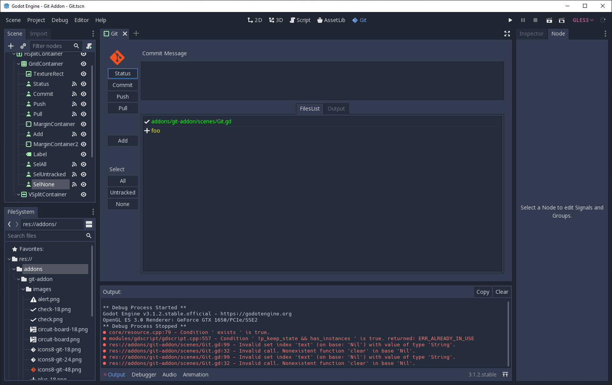

Git Addon for Godot Engine
==========================

This is a super simple git addon for Godot Engine that handles the basics
of day to day git operations. You will still need a proper git client to do
anything remotely intricate.

This, presently, just handles the following git commands

- status
- commit
- pull
- push

Requires
--------

- written in Godot 3.1.2
- needs `git` on the path

Why?
----

I got annoyed with windows not having a real terminal so I wanted to do 
basic operations from within Godot. That's all :)

TODO (someday):
---------------

- add some colors to output
- how to add icon to top bar?
- add new files to git somehow
- open proper client from here or editor maybe?

Attributions
------------

Icon pilfered from Icons8 https://icons8.com/icons/set/git

